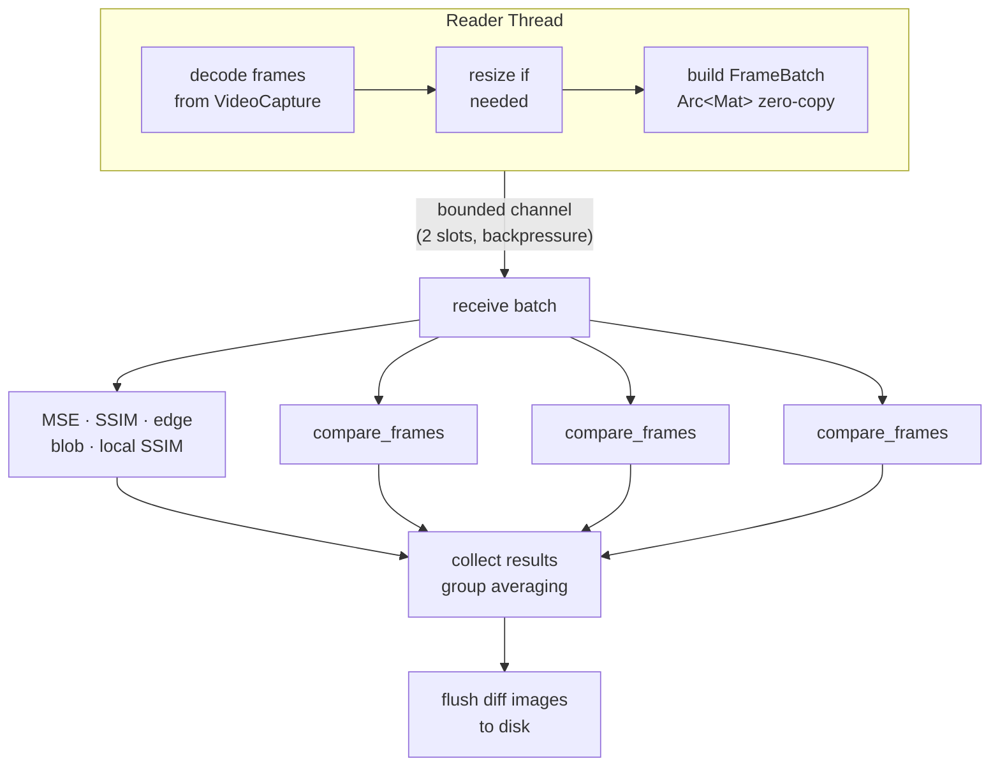

# kensa

kensa is a fast, multi-threaded video comparison tool that identifies significant visual differences between two video files frame-by-frame.

originally this was built for verifying complex [ASS](https://en.wikipedia.org/wiki/SubStation_Alpha) subtitle rendering in anime but it's tunable for other use cases where you might need to spot differences between two versions of a video.

## why

subtitle rendering is not always consistent across tools and versions. different builds of [libass](https://github.com/libass/libass), different rendering pipelines, or different filter chains can produce subtly (or not so subtly) different hardsubbed output from the same source.

visually scrubbing through thousands of frames to find these differences is pretty brutal, so kensa automates it. compare a reference render against a test render and get a report of every frame where something meaningful changed and a visualization of the difference.

## features

kensa uses six comparison metrics working together to minimize false positives:

1. [MSE](https://en.wikipedia.org/wiki/Mean_squared_error) for raw pixel-level difference
2. broad [SSIM](https://en.wikipedia.org/wiki/Structural_similarity_index_measure) for structural similarity across the full frame
3. local SSIM for minimum structural similarity in any region (catches localized issues like a single missing sign)
4. diff percentage for the proportion of pixels exceeding a difference threshold
5. edge difference for detecting structural elements like text or graphics present in one frame but not the other
6. blob detection for finding contiguous regions of difference while filtering out compression noise to catch coherent shapes like subtitle text

on top of that, frame lookahead compares each frame against adjacent frames in the second video to tolerate minor timing offsets without false-flagging. frame grouping averages metrics across configurable groups to smooth out per-frame encoder noise. fast mode compares at half resolution (4x fewer pixels) for quick first-pass checks. diff visualizations save side-by-side images with amplified difference and heatmap overlays for every flagged group. the JSON report gives you structured output with per-frame metrics, group summaries, and aggregate statistics. the whole thing runs on a multi-threaded pipeline with a dedicated reader thread decoupled from parallel processing workers via bounded channels, scaling across all available cores.

## installation

kensa was written in Rust, and is currently only available as a binary release or built from source.

### binary release

if you're on a silicon mac, download the latest release from the [releases page](https://github.com/techsavvytravvy/kensa/releases).

### build from source

make sure you have the Rust toolchain installed.

clone the repository and build with cargo:

```bash
git clone https://github.com/techsavvytravvy/kensa.git
cd kensa
cargo build --release
```

requires OpenCV 4.x development libraries.

```bash
# macOS
brew install opencv

# ubuntu/debian
sudo apt install libopencv-dev

# arch
sudo pacman -S opencv

# then build
cargo install --path .
```

## usage

```
kensa <video1> <video2> [OPTIONS]
```

video1 is your reference (the "correct" render). video2 is what you're checking against it.

### basic examples

```bash
# compare two renders, output to auto-named directory
kensa reference.mkv test_render.mkv

# specify output directory
kensa reference.mkv test_render.mkv -o ./results

# quick first pass at half resolution
kensa reference.mkv test_render.mkv --fast-compare

# skip saving diff images (faster, less disk usage)
kensa reference.mkv test_render.mkv --no-images
```

### tuning for subtitle QC

the defaults are calibrated for catching ASS subtitle rendering differences in anime. if you're getting too many false positives from encoding differences:

```bash
# raise thresholds to only catch obvious issues
kensa ref.mkv test.mkv --ssim-threshold 0.85 --diff-threshold 5.0 --blob-threshold 15000

# group frames to smooth out per-frame noise (e.g., average over 3 frames)
kensa ref.mkv test.mkv --frame-group-size 3

# disable lookahead if your videos are frame-accurately synced
kensa ref.mkv test.mkv --no-frame-lookahead
```

if you're missing real differences:

```bash
# lower thresholds for stricter comparison
kensa ref.mkv test.mkv --ssim-threshold 0.95 --mse-threshold 100 --blob-threshold 5000

# enable local SSIM threshold to catch small localized changes
kensa ref.mkv test.mkv --local-ssim-threshold 0.3
```

### all options

| option                   | default   | description                                                           |
| ------------------------ | --------- | --------------------------------------------------------------------- |
| `-o, --output`           | auto      | output directory (defaults to `./video_comparison_results_<v1>_<v2>`) |
| `--mse-threshold`        | `225.0`   | MSE above this flags a difference (lower = stricter)                  |
| `--ssim-threshold`       | `0.90`    | SSIM below this flags a difference (higher = stricter)                |
| `--diff-threshold`       | `3.0`     | percentage of differing pixels to flag                                |
| `--edge-threshold`       | `70.0`    | percentage of unmatched edges to flag                                 |
| `--blob-threshold`       | `10000.0` | minimum contiguous diff region size (pixels) to flag                  |
| `--local-ssim-threshold` | `0.0`     | minimum local SSIM to flag                             |
| `--save-frames`          | `500`     | max number of diff visualization images to save                       |
| `--no-images`            | `false`   | skip saving diff images entirely                                      |
| `--fast-compare`         | `false`   | compare at half resolution (4x faster)                                |
| `--frame-lookahead`      | `true`    | compare against ±1 adjacent frames to handle timing offsets           |
| `--frame-group-size`     | `1`       | number of frames to average together per group                        |
| `-w, --workers`          | auto      | number of processing threads (defaults to all cores)                  |
| `-b, --batch-size`       | `30`      | frames decoded per batch                                              |
| `--flush-interval`       | `50`      | write diff images to disk every N frames (controls memory)            |

## output

the output directory contains a `comparison_results.json` with the full structured report, plus `diff_frame_NNNNNN.png` visualization images for each flagged group.

each diff image is a 2x2 grid: video 1 and video 2 on top, amplified difference and a JET heatmap on the bottom.

the JSON report includes per-group and per-frame breakdowns:

```json
{
  "video1": { "path": "ref.mkv", "frames": 34568, "fps": 23.976, "resolution": "1920x1080" },
  "video2": { "path": "test.mkv", "frames": 34568, "fps": 23.976, "resolution": "1920x1080" },
  "comparison": {
    "frames_compared": 34568,
    "significant_groups": 12,
    "significant_frames": 47,
    "percentage_different": 0.14
  },
  "statistics": {
    "mse": { "mean": 3.42, "std": 18.91, "min": 0.0, "max": 412.7 },
    "ssim": { "mean": 0.9987, "std": 0.0041, "min": 0.7823, "max": 1.0 }
  },
  "different_groups": [
    {
      "frames": "891-893",
      "timestamp": "37.16s-37.25s",
      "avg_ssim": 0.8234,
      "avg_blob_diff_pixels": 24500,
      "individual_frames": [ ... ]
    }
  ]
}
```

## how the detection works

kensa uses a tiered detection system to separate real visual differences from encoder noise.

primary triggers (any one of these flags a group): SSIM below threshold indicating overall structural change, diff percentage above threshold indicating widespread pixel differences, blob size above threshold indicating a coherent region of difference like subtitle text, or local SSIM strongly negative indicating clear localized structural damage.

secondary triggers only fire when SSIM also shows some degradation (below 0.97): MSE above threshold, edge difference above threshold, or local SSIM below threshold.

the two-tier approach means compression artifacts and minor encoding differences won't trigger false positives on their own, but genuine structural changes (like missing subtitles) get caught even if they're small relative to the full frame.

## architecture



the reader thread handles sequential video decoding (OpenCV's `VideoCapture` isn't thread-safe) while the processing side parallelizes the expensive per-frame comparisons across all available cores. backpressure via the bounded channel keeps memory usage stable regardless of video length.

## performance tips

use `--fast-compare` for a quick first pass. catches most issues at 4x speed. increase `--batch-size` if you have RAM to spare since it reduces synchronization overhead. use `--no-images` if you only need the JSON report, saves significant I/O time. increase `--frame-group-size` to 2-3 for long videos to reduce noise and output size (may affect accuracy). lower `--flush-interval` if memory is tight, trading I/O frequency for lower peak RAM.

## author

i ([travis wagner](https://x.com/techsavvytravvy)) made this as a personal project on personal time. please let me know if you find it useful or have any suggestions for improvement.
